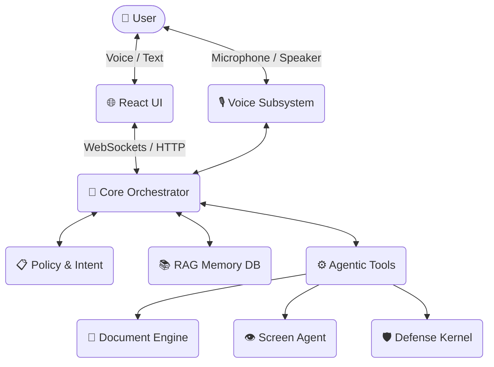

<div align="center">

# 🧠 ORION
**Cognitive Agentic Intelligence with Kernel-Aware Defensive Capabilities**

[](#)
[](#)
[](#)

*ORION is not a chatbot. It is a goal-oriented cognitive execution layer built to reason, inspect, and act.*

</div>

---

## 🌌 Overview

**ORION** is a sovereign, offline-first cognitive agent designed for secure, system-aware execution environments. It integrates structured reasoning, task orchestration, controlled system introspection, and defensive diagnostics into a unified architecture.

Unlike cloud-dependent AI assistants, ORION is engineered to operate entirely on **localhost**, enabling high-trust deployment in research, cybersecurity, and controlled infrastructure environments.

## ✨ Core Design Principles

- 🛡️ **Sovereignty**: No mandatory external API dependencies—fully independent execution.
- ⚙️ **Agentic Execution**: Goal-driven task decomposition and intelligent routing.
- 🔍 **System Awareness**: Controlled, deep host-level inspection and monitoring.
- 🔌 **Offline-First**: Specifically architected for secure localhost deployment.
- 🧩 **Modular Architecture**: Clean separation of cognition, execution, UI, and storage.

---

## 🧠 System Architecture



ORION operates through highly-decoupled, specialized layers:

### 1️⃣ Cognitive Layer & Core Orchestrator (`src/`)
The cognitive core goes beyond simple prompt-response behavior. It processes input through a multi-stage reasoning pipeline, parsing intent and intelligently routing tasks to the appropriate sub-systems (`Planner`, `Tools`, `Memory`). The system dynamically enriches context using session memory (`memory.json`), host state signals, prior execution traces, and structured task history.

### 2️⃣ Agentic Execution Engine
Tasks are never executed blindly. The engine provides recursive task handling, multi-step reasoning, execution validation loops, and controlled command invocation with strict output verification.

### 3️⃣ ORION Document Engine (`📄 Document Engine`)
A high-performance sub-system dedicated to the synthesis, generation, and formatting of complex data.
- **How it Works**: When the Orchestrator identifies a large-scale writing or reporting task, it delegates execution to the Document Engine. The engine performs iterative retrieval from the `RAG Memory DB`, structures an outline, and generates comprehensive, production-ready outputs (PPT, PDF, DOCX).
- **Capabilities**: Capable of generating extensive multi-page documents (e.g., thousands of words, highly structured tokens) with intelligently planned sections, maintaining strict coherence throughout the process.

### 4️⃣ Kernel-Aware Defensive Module (`🛡️ Defense Kernel`)
Acts as a cognitive defensive companion establishing a robust security posture against unauthorized actions and prompt injections.
- **How it Works**: Before the Orchestrator or Agentic Tools execute any high-risk system command, the request is evaluated against strict security constraints. The Defense Kernel monitors process execution, parses event logs, and inspects host state. If it detects malicious payloads, unauthorized logic, or policy violations, the execution is hard-blocked and a security incident is logged.
- **Capabilities**: Process inspection, port monitoring, system anomaly diagnostics, and real-time adversarial prompt blocking. *Note: Operates strictly in user-space using WMI, PowerShell auditing, process handle enumeration, and OS metadata, avoiding kernel code modification.*

### 5️⃣ Memory Architecture (`📚 RAG Memory DB`)
Persistent memory maintains session summaries, context reinforcement data, structured state persistence, and optionally encrypted memory segments. It is configurable for stateless execution, controlled persistent, or research logging modes.

---

## 🛠️ Tech Stack & Components

- **Backend (`src/`, `bin/`, `jobs/`)**: Built in Python, managing agent orchestration, task scheduling, local DBs, and runtime execution. Quality enforced via `flake8` and `pylint`.
- **Frontend (`orion_ui/`)**: React/Vite-based interface providing real-time interactions, execution trace visualization, and diagnostic panels over WebSocket and API.

---

## 📁 Project Structure

<details>
<summary><b>Click to expand directory structure</b></summary>

```text
ORION/
├── .git/                  # Version control metadata
├── .orion_backup/         # Internal backup snapshots
├── bin/                   # Launch scripts and runtime executables
├── databases/             # Structured storage and local DB files
├── docs/                  # Technical documentation
├── jobs/                  # Background task definitions & schedulers
├── orion_ui/              # Frontend interface (React/Vite)
├── outputs/               # Generated artifacts and logs
├── src/                   # Core backend source code
├── tests/                 # Unit and integration tests
├── memory.json            # Persistent structured memory store
├── server                 # Backend entry definition
├── requirements.txt       # Python dependencies
├── flake8_core.txt        # Linting configuration
└── pylint_core.txt        # Static analysis configuration
```
</details>

---

## 🚀 Getting Started

### 1️⃣ Install Dependencies
```bash
pip install -r requirements.txt
```

### 2️⃣ Launch the Backend
```bash
python server
```

### 3️⃣ Launch the Frontend
```bash
cd orion_ui
npm install
npm run dev
```

---

## 🔐 Security & Safety Model

ORION follows a strictly layered defensive posture:

- ✅ **Pre-Execution Validation**: Input is rigorously checked before any execution.
- ✅ **Controlled Wrappers**: System commands execute within secure wrappers.
- ✅ **Execution Logging**: All actions are safely logged for auditability.
- ✅ **Least Privilege**: Operates with non-elevated default privileges.
- ✅ **Air-Gapped Ready**: No automatic external data transmission; outbound traffic requires explicit permission.

---

## 🎯 Use Cases

- 🔬 **Offline AI reasoning workstation**
- 🛡️ **Cognitive system diagnostics assistant**
- 🧪 **Research-grade agentic experimentation platform**
- 🖥️ **Defensive host monitoring companion**
- 🎓 **Educational OS introspection tool**

---

## 🧬 Why ORION?

| Feature | Traditional AI Assistant | ORION |
| :--- | :--- | :--- |
| **Execution Phase** | Reactive & Passive | **Goal-driven & Proactive** |
| **Environment** | Cloud-dependent | **Local-first / Offline** |
| **Contextual Memory** | Stateless chat limits | **Structured memory vault** |
| **System Capabilities** | No system awareness | **Host introspection** |
| **Thinking Process** | Single-pass reasoning | **Multi-stage execution loops** |

---

## 📌 Development Roadmap

ORION is an evolving research-grade cognitive system under active development. Upcoming enhancements include:

- [ ] 🔒 **Encrypted memory vault**
- [ ] 📦 **Sandboxed command executor**
- [ ] 🤖 **Multi-agent coordination**
- [ ] 📊 **Structured task graph execution**
- [ ] 🚨 **Advanced anomaly detection models**

---

<div align="center">
  <b>Private Research Prototype</b><br>
  <i>Developed for applied AI systems engineering and sovereign cognitive architecture research.</i>
</div>
